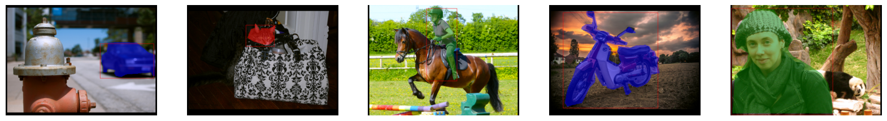

# SOLO Instance Segmentation

SOLO (Segmenting Objects by Locations) is an instance segmentation project that segments objects in an image using a unique approach where objects are localized and segmented in a unified process.

## Project Structure
- **datasets/**: Contains scripts and data for handling datasets.
- **images/**: Includes sample images for inference and visualization.
- **models/**: Contains model architectures used for segmentation.
- **trainer.py**: The main training script for training the segmentation model.
- **inference.py**: Script for running inference on images using a pre-trained model.
- **utils/**: Utility functions for data preprocessing, post-processing, and visualization.

## Installation and Requirements
To run this project, ensure you have the following installed:
- Python 3.7 or higher
- PyTorch
- torchvision
- NumPy
- OpenCV

Install dependencies using:
```
pip install -r requirements.txt
```

## Usage

1. **Training the model**
  To train the model, use the `trainer.py` script:
  ```
    python trainer.py
  ```

2. **Running Inference**
   To test the model on sample images, run:
   ```
   python inference.py
   ```

## Results

The project outputs segmented images where each instance is highlighted distinctly.

Following are the loss curves for training and validation:

<table>
  <tr>
      <td align="center">  </td>
      <td align="center">  </td>
      <td align="center">  </td>
  </tr>
  <tr>
      <td align="center"> Total training loss</td>
      <td align="center"> Focal loss (Category) for training data </td>
      <td align="center"> Dice loss (Mask) for training data </td>
  </tr>
</table>

<table>
  <tr>
      <td align="center">  </td>
      <td align="center">  </td>
      <td align="center">  </td>
  </tr>
  <tr>
      <td align="center"> Total Validation loss</td>
      <td align="center"> Focal loss (Category) for validation data </td>
      <td align="center"> Dice loss (Mask) for validation data </td>
  </tr>
</table>

## Sample Dataset and Predictions

### Sample Dataset
Below is an image showing a sample from the dataset used for training and validation:



### Predictions
Here are some example predictions made by the model:

<table>
  <tr>
      <td align="center">  </td>
      <td align="center">  </td>
      <td align="center">  </td>
  </tr>
  <tr>
      <td align="center"> Prediction 1 </td>
      <td align="center"> Prediction 2 </td>
      <td align="center"> Prediction 3 </td>
  </tr>
</table>

### Explanation
These predictions illustrate the model's ability to segment instances in the input images effectively, highlighting its performance on unseen data.

## Usage

Customize the dataset and modify configurations as needed in the `datasets/yolo_dataset.py` script. The output from training and predictions can be visualized using the provided utility scripts.

## Contact

For any questions or issues, please feel free to reach out or contribute to this project.
